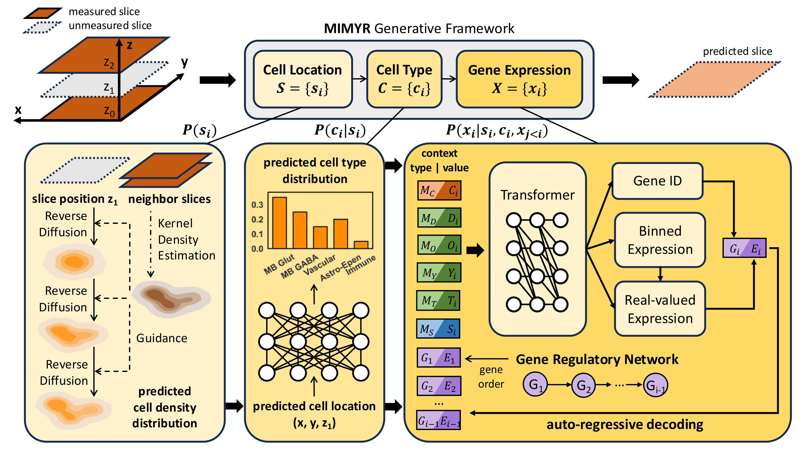

# Overview of MIMYR

MIMYR is a generative framework for spatial transcriptomics data reconstruction and imputation. The framework leverages deep learning to predict cellular locations, cell type classifications, and gene expression patterns in spatial transcriptomics data.

The framework consists of three key components:

1. **Location Model**: A diffusion-based model (DDPM) that generates spatial coordinates for cells, with optional KDE-based biological priors for spatially-aware sampling.

2. **Cell Type Model**: A neural network classifier that predicts cell type labels (clusters) based on spatial features and context.

3. **Expression Model**: A model for predicting gene expression patterns conditioned on spatial location and cell type information.

This integrated approach enables robust reconstruction of spatial transcriptomics data by jointly modeling spatial organization, cellular identity, and molecular profiles.

---

# Running MIMYR

## Installation

### Step 1: Create a Conda Environment

We recommend using **Anaconda** to manage your environment. If you haven't already, refer to the [Anaconda webpage](https://www.anaconda.com/) for installation instructions.

Create a Python environment using the following command:
```bash
conda create --name mimyr python=3.10
```

Activate the environment:
```bash
conda activate mimyr
```

### Step 2: Install Dependencies

#### Install PyTorch with CUDA
If you have an NVIDIA GPU and want to use CUDA for acceleration, install PyTorch with the desired CUDA version:
```bash
pip install torch
```

#### Install Remaining Dependencies
Install the remaining required packages:
```bash
pip install -r requirements.txt
```

---

## Running the Code

The pipeline consists of three components: location modeling, cell type classification, and gene expression prediction.

The entry point is main.py, which supports two modes: inference and training, selected via a command-line argument.

### Inference mode
Use inference mode to reproduce the results in the paper. To run using inference mode, use the following command:
```bash
python main.py
```

This will:
1. Automatically download the necessary data and model checkpoints if not present.
2. Load and prepare the spatial transcriptomics data.
3. Run inference using the pretrained models.
4. Evaluate predictions and save results to CSV and artifact directories.

### Training Mode

Training mode fine-tunes the expression model on a new tissue sample using distributed data-parallel (DDP) training via `torchrun`. It requires a directory of `.h5ad` files containing:

- `obsm["aligned_spatial"]`: spatial (CCF) coordinates
- `obs["cluster"]`: cell-type or cluster labels
- `X`: gene expression matrix

Launch training with `torchrun` instead of `python`:
```bash
torchrun --nproc_per_node=<NUM_GPUS> main.py \
  --run_mode train \
  --skip_combined_fit \
  --data_mode rq1 \
  --data_dir /path/to/data \
  --expression_model_checkpoint /path/to/base_checkpoint.pt \
  --expression_from_finetuned \
  --expression_output_dir /path/to/save/checkpoints \
  --expression_epochs 1000 \
  --expression_batch_size 128
```

Use `--skip_combined_fit` to skip retraining the location and cell type models and go straight to expression model training. After training, rerun `main.py` in inference mode using the newly saved checkpoints to generate predictions.

Ready-to-use SLURM sbatch scripts for base training and finetuning are provided in `models/`:
- `models/run_train_base_noreweight.sbatch` — base expression model training (rq1)
- `models/run_finetune_rq3.sbatch` — finetuning on rq3 data
- `models/run_finetune_rq4.sbatch` — finetuning on rq4 data


### Other Command-Line Arguments

You can customize the pipeline behavior using various command-line arguments:
```bash
python main.py \
  --data_mode rq1 \
  --data_label cluster \
  --location_model_checkpoint model_checkpoints/smoothtune_conditional_ddpm_2d_checkpoint_400.pt \
  --cluster_model_checkpoint model_checkpoints/best_model_rq1.pt \
  --expression_model_checkpoint model_checkpoints/TG-base4_epoch4_model.pt \
  --batch_size 1024 \
  --device cuda \
  --out_csv results/output.csv
```

#### General Arguments:
- `--run_mode`: `inference` (default) or `train`
- `--data_mode`: Dataset mode (default: `rq1`)
- `--data_label`: Label type for classification (default: `cluster`)
- `--location_inference_type`: Type of location inference (`model`, `closest_slice`, or `skip`)
- `--cluster_inference_type`: Type of celltype inference (`model`, `majority_baseline`, or `skip`)
- `--expression_inference_type`: Type of expression inference (`model`, `lookup`, or `skip`)
- `--kde_bandwidth`: Bandwidth for KDE-based location model (default: 0.01)
- `--guidance_signal`: Guidance strength for conditional generation (default: 0.01)
- `--metrics`: Comma-separated list of evaluation metrics (default: `soft_accuracy`)
- `--metric_sampling`: Percentage of samples for metric computation (default: 100)
- `--device`: Computing device (`cuda` or `cpu`)

#### Training-Specific Arguments (`--run_mode train`):
- `--skip_combined_fit`: Skip location/celltype model training; go directly to expression model training
- `--training_slice_directory` / `--val_slice_directory`: Directories for train/val `.h5ad` files
- `--expression_model_checkpoint`: Path to the base or finetuned expression checkpoint to resume from
- `--expression_from_finetuned`: Flag indicating the checkpoint is already finetuned (affects weight loading)
- `--expression_output_dir`: Directory to save expression model checkpoints (default: `model_checkpoints/expression_finetuned`)
- `--expression_epochs`: Number of training epochs (default: 5)
- `--expression_batch_size`: Batch size per GPU (default: 8)
- `--expression_lr`: Learning rate (default: 5e-5)
- `--expression_lambda_val`: Weight on MSE expression loss term (default: 1.0)
- `--expression_max_len`: Maximum sequence length for prompts + genes (default: 512)
- `--expression_save_frequency`: Epochs between checkpoints (default: 10)
- `--expression_epoch_samples`: Rows to draw per epoch; `-1` uses the full dataset
- `--expression_log_per_steps`: Log to W&B every N steps (default: 100)
- `--expression_xyz_noise`: Add noise to spatial coordinates during training
- `--expression_no_shuffle`: Disable DataLoader shuffling
- `--expression_new_expression_size`: Override `n_expression_level` in the expression model
- `--expression_adata2`: Optional path to a second `.h5ad` file (e.g. scRNA-seq reference) merged into training
- `--expression_metadata_dir`: Directory containing expression model metadata files
- `--expression_model_size`: Initialise a new expression model from scratch (`small`, `medium`, or `large`); used when no checkpoint is provided
- `--expression_rebalance_only`: Only update the rebalancing layer of the expression model

### Output

The pipeline generates:
- **CSV file**: Evaluation metrics for each test slice
- **Artifact directory**: Contains per-slice results including:
  - `config.json`: Configuration parameters used
  - `results.json`: Evaluation metrics
  - `pred.pkl`: Prediction outputs

---

## Project Structure
```
MIMYR/
├── models/
│   ├── diffusion_model.py            # DDPM location model
│   ├── celltype_model.py             # Cell type classifier
│   ├── biological_model.py           # KDE-based spatial prior
│   ├── combined_model.py             # Wraps location + celltype models
│   ├── gene_exp_model.py             # Gene expression tokenization utilities
│   ├── __init__.py                   # Makes models/ a package
│   ├── generative_transformer/       # Transformer-based expression model
│   │   ├── Mimyr.py                  # MimyrModel architecture
│   │   ├── finetune_mimyr.py         # Expression model training logic (DDP-aware)
│   │   ├── data_util.py              # Data harmonization utilities
│   │   └── __init__.py              # Exports train_expression_model, get_expression_parser
│   ├── run_train_base_noreweight.sbatch  # SLURM: base training (rq1, 3 GPUs)
│   ├── run_finetune_rq3.sbatch           # SLURM: rq3 finetuning
│   └── run_finetune_rq4.sbatch           # SLURM: rq4 finetuning
├── data_loader.py               # SliceDataLoader: data loading and preprocessing
├── inference.py                 # Inference pipeline
├── evaluator.py                 # Evaluation metrics
├── metrics.py                   # Metric implementations
├── main.py                      # Single entry point (inference and train modes)
└── model_checkpoints/           # Pretrained model weights
```

